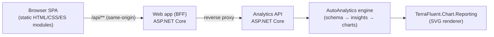
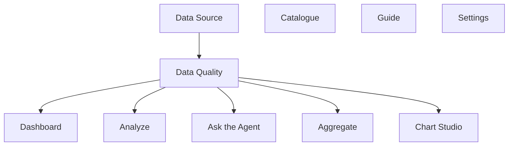
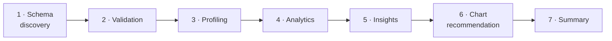

# ADP Analytics & Reporting Studio — Web Application Guide

A complete, illustrated guide to the **Analytics & Reporting Studio** web app: what it is,
how to run it, a screen‑by‑screen tour, step‑by‑step navigation paths for the
common workflows, and a full reference to the **concepts, theories and formulas** the engine uses
to analyse your data.

> The examples in this guide reference the built‑in **“Global Sales 2023–2024”** sample dataset
> (24 monthly rows across Region and Product, with a deliberate one‑off spike in April 2024), so you
> can reproduce every screen and workflow exactly as described.

---

## Table of contents

1. [What the app is](#1-what-the-app-is)
2. [Architecture at a glance](#2-architecture-at-a-glance)
3. [Running it locally](#3-running-it-locally)
4. [The interface](#4-the-interface)
5. [Screen‑by‑screen tour](#5-screen-by-screen-tour)
   - [5.1 Data Source](#51-data-source)
   - [5.2 Dashboard](#52-dashboard)
   - [5.3 Analyze](#53-analyze)
   - [5.4 Ask the Agent](#54-ask-the-agent)
   - [5.5 Aggregate](#55-aggregate)
   - [5.6 Data Quality](#56-data-quality)
   - [5.7 Chart Studio](#57-chart-studio)
   - [5.8 Catalogue](#58-catalogue)
   - [5.9 Settings](#59-settings)
   - [5.10 Guide (in‑app help)](#510-guide-in-app-help)
6. [Navigation paths (step‑by‑step workflows)](#6-navigation-paths-step-by-step-workflows)
7. [The analytics engine — concepts, theories & formulas](#7-the-analytics-engine--concepts-theories--formulas)
8. [Reference tables](#8-reference-tables)

---

## 1. What the app is

The Studio is a browser front‑end over the **TerraFluent AutoAnalytics** engine. You give it a
dataset (CSV or JSON), and it automatically:

- **profiles** every column (type, role, distribution),
- **validates** data quality,
- **discovers** trends, correlations, anomalies, drivers, segments and period‑over‑period changes,
- **writes** ranked, plain‑English insights,
- **recommends and renders** the most appropriate charts, and
- answers **natural‑language questions** through a deterministic “agent”.

Two principles shape everything:

| Principle | What it means |
|-----------|---------------|
| **Deterministic, no AI/cloud** | Every number and narrative comes from explicit statistics. The same input always produces the same output — results are reproducible and auditable. |
| **In‑memory only** | Data is processed in memory and never written to a database, disk or browser storage. Analytic sessions self‑expire after 30 minutes. |

---

## 2. Architecture at a glance

The web app is a **Backend‑for‑Frontend (BFF)**. The browser only ever talks to the web app
(same‑origin), which reverse‑proxies every `/api/**` call to the analytics API. The API hosts the
AutoAnalytics engine, which in turn renders charts with the TerraFluent chart library.



- **Browser SPA** — a dependency‑free single‑page app: native ES modules under `wwwroot/js/`
  (`main.js` router + one `view-*.js` per screen), styled by `wwwroot/css/site.css`.
- **Web app (BFF)** — [`src/TerraFluent.Chart.Reporting.Web`](../../src/TerraFluent.Chart.Reporting.Web);
  serves the static shell and proxies `/api/**` to the API. No CORS, no mixed content.
- **Analytics API** — [`src/TerraFluent.Chart.Reporting.Api`](../../src/TerraFluent.Chart.Reporting.Api);
  REST endpoints for analyze / dashboard / ask / aggregate / validate / chart rendering.
- **Engine** — [`src/TerraFluent.AutoAnalytics`](../../src/TerraFluent.AutoAnalytics); the maths.
- **Renderer** — [`src/TerraFluent.Chart.Reporting`](../../src/TerraFluent.Chart.Reporting); server‑side SVG.

---

## 3. Running it locally

You need the two ASP.NET Core apps running side by side. The web app proxies to the API at
`http://localhost:49684` by default (configurable via `Api:BaseUrl`).

**1. Build once**

```powershell
dotnet build TerraFluent.Chart.Reporting.sln --configuration Release
```

**2. Start the API** (terminal 1) — this is the upstream the web app proxies to:

```powershell
dotnet run --project src\TerraFluent.Chart.Reporting.Api\TerraFluent.Chart.Reporting.Api.csproj --configuration Release --urls "http://localhost:49684"
```

**3. Start the web app** (terminal 2):

```powershell
dotnet run --project src\TerraFluent.Chart.Reporting.Web\TerraFluent.Chart.Reporting.Web.csproj --configuration Release --urls "http://localhost:5080"
```

**4. Open** `http://localhost:5080` in a browser.

| App | Default dev URLs |
|-----|------------------|
| Web (front‑end) | `https://localhost:7080` · `http://localhost:5080` |
| API (upstream)  | `https://localhost:49682` · `http://localhost:49684` |

> Health checks: `GET /api/health/live` (process up) and `GET /api/health/ready` (engine warm).
> If the Dashboard/Analyze pages spin on “Preparing…”, the API is not reachable — confirm it is
> listening on the port named in `Api:BaseUrl`.

---

## 4. The interface

Every screen shares the same chrome:

- **Left sidebar** — the ten navigation items (including an in‑app **Guide**), plus a live
  **dataset badge** and a privacy chip (“In‑memory only · never stored”).
- **Top bar** — the current view title, an **Agent status** indicator, and a Settings shortcut.
- **Content area** — the active view.



**Guarded navigation.** Dashboard, Analyze, Ask the Agent, Aggregate and Chart Studio all consume
the active dataset. Opening one without a dataset diverts you to **Data Source**; opening one when
the dataset has **quality issues** diverts you (once) to **Data Quality** so problems are reviewed
before you run analytics. Catalogue, Guide and Settings are always available.

---

## 5. Screen‑by‑screen tour

### 5.1 Data Source

The entry point for every workflow. Provide data by **pasting**, **uploading a file**
(CSV/JSON/TXT, drag‑and‑drop), or picking a **Sample**. Choose a name and a format
(**Auto‑detect**, CSV or JSON array), then click **Use this dataset**.

**Key controls:** *Paste* · *Upload* (drag‑and‑drop CSV/JSON/TXT) · *Samples* · *Name* · *Format*
(Auto‑detect / CSV / JSON array) · **Use this dataset**.

Six built‑in samples cover a range of shapes (small trend data through ~5,000‑row datasets):

| Sample | Shape |
|--------|-------|
| **Monthly Sales** | 24 months · Region & Product · Revenue/Cost/Units · one anomaly |
| **Web Traffic** | 12 weeks · Channel · Sessions/Conversions |
| **Headcount (JSON)** | Departments · headcount & attrition, as a JSON array |
| **E‑commerce Orders** | ~5,000 orders · Channel/Category/Country · totals & status |
| **IoT Sensor Readings** | ~5,000 readings · Devices/Sites · temperature/vibration alerts |
| **Support Tickets** | ~5,000 tickets · Priority/Channel/Agent · resolution & CSAT |

Once loaded, a **preview** of the first rows appears and the dataset badge updates. The app
validates immediately; if it is clean you are invited to head to Dashboard or Analyze.

### 5.2 Dashboard

A **smart dashboard** assembled automatically: KPI tiles plus the trend, comparison, distribution,
smoothed, cumulative and composition charts the engine judged most informative for this dataset.
Use **KPIs** to choose how many headline tiles to show, **Generate dashboard** to rebuild, and
**Export dashboard** to download a self‑contained HTML page.

**Tiles generated:** KPI headlines plus trend, comparison, distribution, smoothed, cumulative and
composition charts — each chosen by the recommendation engine (§6) for this dataset’s shape.

### 5.3 Analyze

The full analysis report for the dataset: a headline, key findings, ranked **insights** (each with a
0–100 importance score and an explanation), and a grid of **recommended charts** (each with a
suitability score and the reason it was chosen). **Export analysis** produces a self‑contained HTML
report.

### 5.4 Ask the Agent

Natural‑language Q&A over the dataset. Type a question or pick a **suggested question** (generated
from the dataset’s own columns). Two modes:

- **Single question** — one‑shot analysis.
- **Conversation** — a session that remembers context, so follow‑ups like *“forecast it”* resolve
  the pronoun to the last measure discussed.

The agent parses the question into an intent, follows the evidence, and returns an **explainable
reasoning trace**, the supporting **insights**, and any **charts** it built along the way. The nine
supported intents are listed in §8 (Agent intents).

### 5.5 Aggregate

An interactive group‑by / pivot builder. Pick a **measure**, a **dimension**, an optional **second
dimension** (to pivot), and an **aggregation** (Sum, Average, Count, Min, Max, Median), then
**Compute**. The result renders as a table (or pivot grid) plus a chart, with **Export result**.

> Non‑additive measures (age, rates, scores…) are protected: the Studio removes **Sum** from the
> aggregation list for them, defaulting to **Average**, because a grand total would be meaningless.

### 5.6 Data Quality

The validation report for the active dataset: an overall verdict (**Clean / Warnings / Errors**)
and a table of issues (severity, code, column, message, affected count). A clean dataset reports an
overall **Clean** verdict with no issues listed.

A deliberately flawed dataset shows the checks firing — for example a duplicate identifier key
(**Error**) and missing values (**Warning**). This is also the page the router diverts you to when
you try to run analytics on data that isn’t clean. See §7 Phase 2 for the full list of checks and
their severities.

### 5.7 Chart Studio

A full chart composer. **Load from your dataset** to seed it from an aggregation, or build from
scratch: choose a **chart type**, **theme** and **render mode**; edit the title, categories, axis
titles and one or more series; tune size, background, legend, grid lines, data labels and stacking.
A **live preview** updates as you edit, and you can **download SVG/PNG**, **copy SVG/embed**, or
create a **share link**.

### 5.8 Catalogue

A gallery/playground of the chart library’s capabilities — every supported chart type rendered from
sample data, with an embedded playground to experiment. Useful as a visual reference when deciding
what to build in Chart Studio. The full list of renderable chart types appears in §8 (Chart types).

### 5.9 Settings

Browser‑local preferences that **seed new charts**: default chart type, theme, render mode, legend
position, size, grid lines / export menu / data labels, and the default aggregation. Also toggles
whether Chart Studio auto‑loads a summarised chart on open. Stored in this browser’s local storage
only — never on a server.

### 5.10 Guide (in‑app help)

The **Guide** view is the in‑app version of this document — reachable any time from the sidebar
(no dataset required). It explains every screen, lists the common workflows, and summarises the
seven‑phase pipeline and the key formulas. Jump chips at the top link to *The screens*, *Workflows*
and *How analysis works*.

> **How users reach the documentation:** open the app → click **Guide** in the left sidebar. The
> deeper written reference (this file, with Mermaid diagrams and full derivations) lives in the
> repository at `docs/web-app/README.md`.

---

## 6. Navigation paths (step‑by‑step workflows)

### Path A — Load data and read the auto‑analysis

1. Open the app → you land on **Data Source**.
2. Click **Samples** → **Monthly Sales → Load** (or paste your own CSV/JSON).
3. Click **Use this dataset**. The preview appears and the data is validated.
4. If clean, click **Analyze** in the sidebar.
5. Read the **headline** and **key findings**, scroll the ranked **insights**, and review the
   **recommended charts**.
6. *(Optional)* Click **Export analysis** to download the HTML report.

### Path B — Build the smart dashboard

1. Complete **Path A steps 1–3** (a clean dataset is active).
2. Click **Dashboard**.
3. Set **KPIs** (headline tiles) and click **Generate dashboard**.
4. Hover charts for tooltips; use the in‑chart **export menu** for PNG/SVG/PDF.
5. *(Optional)* Click **Export dashboard** for a self‑contained HTML page.

### Path C — Ask a question

1. With a clean dataset active, click **Ask the Agent**.
2. Choose **Single question** or **Conversation**.
3. Click a **suggested question** (e.g. *“Why did Revenue change?”*) or type your own and click
   **Ask**.
4. Read the **answer headline**, expand the **reasoning path**, and inspect the **insights** and
   **supporting charts**.
5. In **Conversation** mode, ask a follow‑up (e.g. *“forecast it”*) — context carries over.

### Path D — Group / pivot a measure

1. With a clean dataset active, click **Aggregate**.
2. Pick **Measure** (e.g. Revenue), **Dimension** (e.g. Region).
3. *(Optional)* Pick a **Second dimension** to pivot (e.g. Product) and an **Aggregation**.
4. Click **Compute** → read the table/pivot and chart.
5. *(Optional)* **Export result**.

### Path E — Fix data‑quality issues

1. On **Data Source**, load data that has problems (e.g. a duplicate key or missing values).
2. Click **Use this dataset** → you are diverted to **Data Quality** automatically.
3. Review each issue (severity, code, column, affected count).
4. Correct the source data and re‑paste, or click **Validate** to re‑check.
5. Once **Clean**, continue to Dashboard / Analyze.

### Path F — Compose and share a chart

1. Click **Chart Studio**.
2. Click **Load from your dataset** (or set type/categories/series manually).
3. Adjust **theme**, **render mode**, axis titles, size and options; watch the **preview**.
4. **Download PNG/SVG**, **Copy embed**, or **Share link**.

---

## 7. The analytics engine — concepts, theories & formulas

Everything the app shows is produced by a **deterministic seven‑phase pipeline**. The same dataset
always yields the same profile, insights and charts.



Notation used below: a numeric sample is $x_1,\dots,x_n$ with mean $\bar{x}$, sample standard
deviation $s$, sorted order statistics $x_{(1)}\le\cdots\le x_{(n)}$, and median $\tilde{x}$.

### Phase 1 — Schema discovery

Each column is classified by **sampling every cell and voting**. The engine counts how many
non‑missing cells parse as numeric, integer, date, boolean, currency and percentage, and tracks the
distinct‑value set. With `considered` non‑missing cells it computes ratios such as

$$\text{numericRatio} = \frac{\#\text{numeric}}{\text{considered}},\qquad
  \text{uniqueness} = \frac{\#\text{distinct}}{\text{considered}}.$$

Decision rules (in order):

- **Boolean** if `boolRatio ≥ 0.95` and at most two distinct values.
- **Date** if `dateRatio ≥ 0.9` **and** `numericRatio < 0.9` (so plain years aren’t mistaken for dates).
- **Percentage / Currency** if `numericRatio ≥ 0.9` and ≥ 60 % of cells look like `%` or money.
- **Identifier** if integer‑heavy (≥ 98 %) **and** the name looks like a key (`…id`, `key`, `code`,
  `guid`, `uuid`, `sku`).
- **Numeric** otherwise when `numericRatio ≥ 0.9`.
- **Category** if low cardinality ($\text{distinct} \le \max(20, 0.2\cdot\text{considered})$), else **Text**.

A **semantic role** (`RevenueMetric`, `CostMetric`, `ProfitMetric`, `QuantityMetric`,
`DateDimension`, `GeographyDimension`, `CategoryDimension`, `IdentifierRole`) is then inferred from
the column name and profile. Role drives smarter chart choices.

**Additive vs non‑additive.** A key concept: can a measure be *summed*? A measure is **additive**
(summable) only when it is currency, or its role is Revenue/Cost/Profit/Quantity — and it is forced
**non‑additive** (averaged) when it is a percentage, its values lie in $[0,1]$ (a ratio/probability),
or its name contains an attribute token (`age`, `rate`, `score`, `rating`, `temperature`, `index`,
`price`, …). This is why the app sums Revenue by Region but averages a satisfaction score.

### Phase 2 — Validation

Six checks produce severity‑graded issues (**Info / Warning / Error**):

| Code | Fires when | Severity |
|------|-----------|----------|
| `EMPTY_DATASET` | zero rows | Error |
| `LOW_ROW_COUNT` | `< 3` rows | Warning |
| `MISSING_VALUES` | missing fraction $p=\frac{\text{missing}}{\text{total}}$ | $p\ge0.5$ Error · $p\ge0.1$ Warning · else Info |
| `DUPLICATE_ROWS` | identical rows | `>10%` Warning · else Info |
| `DUPLICATE_KEYS` | repeated identifier value | Error |
| `INVALID_FORMAT` | cell doesn’t match the column’s inferred type | `>10%` Error · else Warning |
| out‑of‑range | percentage outside 0–100, negative revenue, age outside 0–130 | Warning |

The overall verdict is **Clean** (nothing above Info), **Warnings**, or **Errors**. The router uses
“not clean” to divert you to Data Quality before analytics.

### Phase 3 — Profiling (descriptive statistics)

For every measure the engine computes a full five‑number summary plus shape statistics.

- **Mean:** $\displaystyle \bar{x}=\frac{1}{n}\sum_{i=1}^{n}x_i$
- **Sample variance / standard deviation:**
  $\displaystyle s^2=\frac{1}{n-1}\sum_{i=1}^{n}(x_i-\bar{x})^2,\qquad s=\sqrt{s^2}$
- **Percentiles (type‑7, linear interpolation).** For percentile $p\in[0,100]$ the fractional rank
  is $r=\tfrac{p}{100}(n-1)$; with $\lfloor r\rfloor$ and $\lceil r\rceil$ the value is
  $$P_p = x_{(\lfloor r\rfloor+1)} + (r-\lfloor r\rfloor)\,\bigl(x_{(\lceil r\rceil+1)}-x_{(\lfloor r\rfloor+1)}\bigr).$$
  Median $=P_{50}$, quartiles $Q_1=P_{25}$, $Q_3=P_{75}$, and $\mathrm{IQR}=Q_3-Q_1$.
- **Skewness (Fisher–Pearson), with** $z_i=\frac{x_i-\bar x}{s}$:
  $$g_1=\frac{n}{(n-1)(n-2)}\sum_{i=1}^{n} z_i^{3}.$$
- **Excess kurtosis:**
  $$g_2=\frac{n(n+1)}{(n-1)(n-2)(n-3)}\sum_{i=1}^{n} z_i^{4}-\frac{3(n-1)^2}{(n-2)(n-3)}.$$

### Phase 4 — Analytics

#### Correlation (relationships between measures)

- **Pearson** (linear):
  $$r=\frac{\sum_{i}(x_i-\bar x)(y_i-\bar y)}{\sqrt{\sum_i (x_i-\bar x)^2}\,\sqrt{\sum_i (y_i-\bar y)^2}}.$$
- **Spearman** (monotonic) = Pearson computed on the **ranks** of $x$ and $y$ (tied values receive
  the average rank).
- **Significance.** Under $H_0:\rho=0$, the statistic
  $$t=r\sqrt{\frac{n-2}{1-r^2}}$$
  follows a Student‑$t$ distribution with $\mathrm{df}=n-2$. The two‑tailed $p$‑value is computed
  from the regularised incomplete beta function,
  $p = I_{x}\!\left(\tfrac{\mathrm{df}}{2},\tfrac12\right)$ with $x=\tfrac{\mathrm{df}}{\mathrm{df}+t^2}$.
  A pair is flagged **significant** when $n\ge3$ and $p<0.05$.
- **Strength** uses the stronger of the two coefficients, $a=\max(|r|,|\rho|)$:
  $\ge0.9$ very strong · $\ge0.7$ strong · $\ge0.4$ moderate · $\ge0.2$ weak · else none.

#### Trend detection

Measures are first collapsed to **one value per calendar period** (summed if additive, averaged
otherwise) so the maths sees an evenly‑spaced series. Then:

- **Ordinary least squares** over the index $0,1,\dots,n-1$ gives slope, intercept and
  $$R^2=\frac{\bigl(\sum_i (x_i-\bar x)(y_i-\bar y)\bigr)^2}{\sum_i (x_i-\bar x)^2\,\sum_i (y_i-\bar y)^2}.$$
- **Theil–Sen robust slope** = the median of all pairwise slopes $\dfrac{y_j-y_i}{j-i}$
  (≈ 29 % breakdown point — outliers can’t flip the direction). Large series are strided to bound cost.
- **Fitted growth** uses the regression line’s endpoints (robust to a noisy last point):
  $\dfrac{\hat y_{n-1}-\hat y_0}{|\hat y_0|}$.
- **Volatility** = coefficient of variation $\left|\dfrac{s}{\bar x}\right|$.
- **Lag‑1 autocorrelation** (persistence):
  $$\rho_1=\frac{\sum_{i=2}^{n}(x_i-\bar x)(x_{i-1}-\bar x)}{\sum_{i=1}^{n}(x_i-\bar x)^2}.$$
- **Seasonality** is detected from the autocorrelation function: the lag $2\le k\le n/2$ with the
  strongest autocorrelation above a 0.3 floor (with a small preference for calendar lags 12/4/7).

A measure is then classified **Rising / Declining / Stable / Seasonal / Volatile** using $R^2$, the
sign agreement between growth and the robust slope, the detected season length, and the volatility.

#### Anomaly detection

Three robust rules, combined, over each measure:

- **Modified z‑score** (Iglewicz–Hoaglin), robust because the median and MAD are not inflated by the
  outlier itself:
  $$M_i=\frac{0.6745\,(x_i-\tilde x)}{\mathrm{MAD}},\qquad \mathrm{MAD}=\operatorname{median}_i|x_i-\tilde x|,$$
  flagged when $|M_i|>3.5$. (Falls back to the classic z‑score only when $\mathrm{MAD}=0$.)
- **IQR fence:** flag $x_i<Q_1-1.5\,\mathrm{IQR}$ or $x_i>Q_3+1.5\,\mathrm{IQR}$.
- **Spike:** a point‑to‑point jump exceeding $3\times$ the median absolute step.

Anomalies are **ranked and scored by a robust, σ‑comparable magnitude**
$\bigl|\,(x_i-\tilde x)/\text{scale}\,\bigr|$ with $\text{scale}=\mathrm{MAD}/0.6745$ (falling back to
$\mathrm{IQR}/1.349$, then $s$) — so a strong outlier is measured on a spread it did **not** inflate.

#### Driver (root‑cause) analysis

Explains *why* a measure moved. Rows are ordered by date and split into an **earlier** and **later**
half; per category the change is $\Delta = \text{late} - \text{early}$, and each category’s
**share of change** is $\dfrac{\Delta_{\text{category}}}{\Delta_{\text{total}}}$. Categories are
ranked by $|\Delta|$ to name the top driver.

#### Period‑over‑period comparison (MoM / QoQ / YoY)

Values are bucketed by calendar period. Consecutive change is
$\text{ChangePct}=\dfrac{v_t-v_{t-1}}{|v_{t-1}|}$, and year‑over‑year compares the latest period to
the same period one year earlier (buckets keyed by the **ISO‑8601 week‑numbering year** for weekly
data so year‑boundary weeks are attributed correctly).

#### Segmentation (k‑means clustering)

Rows are clustered over the numeric measures with **deterministic k‑means**: features are z‑score
standardised, centroids are seeded with **k‑means++** under a fixed RNG seed, and Lloyd’s algorithm
iterates to convergence. The cluster count is $k=\operatorname{clamp}(\lfloor n/6\rfloor,\,2,\,4)$.
Cluster tightness is the within‑cluster sum of squares (inertia)
$\sum_c\sum_{i\in c}\lVert x_i-\mu_c\rVert^2$, and centroids are reported back in original units and
labelled High/Mid/Low on the primary measure.

#### Forecasting

- **Holt’s linear method** (double exponential smoothing):
  $$\ell_t=\alpha x_t+(1-\alpha)(\ell_{t-1}+b_{t-1}),\qquad
    b_t=\beta(\ell_t-\ell_{t-1})+(1-\beta)b_{t-1},$$
  with $h$‑step forecast $\hat x_{t+h}=\ell_t+h\,b_t$.
- **Holt–Winters additive** (triple exponential smoothing) adds a seasonal term $s_t$ of period $L$:
  $\hat x_{t+h}=\ell_t+h\,b_t+s_{t+h-L}$, used when a season is detected and ≥ 2 full cycles exist.
- **Smoothing parameters** $\alpha,\beta,\gamma$ are chosen by a deterministic grid search that
  minimises in‑sample one‑step SSE (so results are reproducible, not hand‑tuned).
- **Confidence band** widens with the horizon like a random walk: $\pm\,1.96\,\sigma\sqrt{h}$,
  where $\sigma$ is the residual standard deviation.

#### Supporting series

- **Moving average** — an adaptive simple moving average with window
  $w=\operatorname{clamp}(\lfloor n/5\rfloor,3,12)$, smoothing noise to reveal the trend.
- **Cumulative series** — a running total $\sum_{i\le t}x_i$ for additive measures.
- **Composition** — a measure broken down across two dimensions (date × category or category ×
  category) for stacked charts, kept only when the cross‑tab is well populated.

### Phase 5 — Insight scoring

Findings become ranked, plain‑English insights. Each importance score is a **weighted, normalised
0–100** value, so scores are explainable and comparable. Examples (each factor clamped to $[0,1]$):

- **Correlation:** $\text{score}=100\cdot\bigl(0.8\,|r| + 0.2\,\min(\tfrac{n}{100},1)\bigr)$.
- **Trend:** $100\cdot\bigl(0.5\,\min(|\text{growth}|,1)+0.35\,R^2+0.15\,\min(\tfrac{n}{24},1)\bigr)$.
- **Dominance:** weights the leading category’s share against an even split across the groups.
- **Anomaly:** scales the peak robust magnitude ($z=3.5\to$ mid, $z=8\to$ full).
- **Distribution:** scales absolute skewness (a strongly skewed measure is worth flagging).

### Phase 6 — Chart recommendation

Rule‑based, each rule emitting a chart with a **suitability score** and a self‑explaining reason:

- **Date + measure → Line** (per‑period), boosted by a strong $R^2$ and longer history; dense
  flat‑noise series with no temporal signal are suppressed.
- **Dimension + measure → Column / Bar** (bar for long labels or many categories).
- **Few additive categories → Pie** (part‑to‑whole, non‑negative only).
- **Correlated measures → binned mean‑trend Line** — $X$ is split into equal‑width bands (≈ $\sqrt{n}$,
  edges snapped to “nice” numbers $1/2/2.5/5\times10^k$) and $Y$ is averaged per band, so unequal $X$
  spacing can’t misrepresent the relationship.
- **Single measure → histogram** (binned column), **Moving average → Spline**,
  **Cumulative → Area**, **Composition → stacked Area/Column/Bar**, **lone metric → Gauge**.

### Phase 7 — Summary

The top insight becomes the **headline**; the next few become **key findings**; counts and the
validation verdict populate the dashboard/analysis header.

---

## 8. Reference tables

### Column types

| Type | Meaning |
|------|---------|
| `Numeric` | Plain quantity (integers or reals). |
| `Currency` | Monetary amount (symbol or currency‑like name). |
| `Percentage` | Ratio out of 100. |
| `Date` | Calendar date/timestamp. |
| `Category` | Low‑cardinality grouping label. |
| `Boolean` | Two‑state value. |
| `Text` | High‑cardinality free text. |
| `Identifier` | Unique row key — excluded from most analysis. |

### Semantic roles

`Unknown`, `RevenueMetric`, `CostMetric`, `ProfitMetric`, `QuantityMetric`, `DateDimension`,
`GeographyDimension`, `CategoryDimension`, `IdentifierRole`.

### Validation issue codes

`EMPTY_DATASET`, `LOW_ROW_COUNT`, `MISSING_VALUES`, `DUPLICATE_ROWS`, `DUPLICATE_KEYS`,
`INVALID_FORMAT`, `PERCENT_OUT_OF_RANGE`, `NEGATIVE_REVENUE`, `AGE_OUT_OF_RANGE`.

### Agent intents

`Explore`, `Trend`, `Correlation`, `Anomaly`, `Dominance`, `Forecast`, `RootCause`, `Compare`,
`Segment` — parsed from the question’s keywords and column‑name matches, then executed as a chain of
deterministic skills.

### Chart types (renderer)

Line, Spline, Bar, Column, Area, Pie, Scatter, Bubble, Waterfall, Gauge, DataRing, Funnel, Treemap,
Parliament, Radar, Heatmap, BoxPlot, ErrorBar, Candlestick, OHLC, ColumnRange, AreaRange, Dumbbell,
Stream, Gantt, Sankey — in **Static**, **Animated** or **Interactive** render modes.

---

*Generated for the TerraFluent Analytics & Reporting Studio. Examples reference the “Global Sales
2023–2024” sample dataset.*
